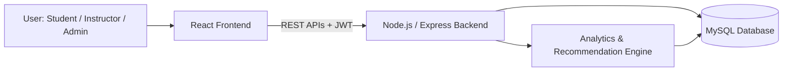

# 🎓 Smart Learning Management System (LMS)

> A web-based learning platform that brings courses, quizzes, progress tracking, analytics, and personalized recommendations into one place for students, instructors, and administrators.


**Quantumard Technologies Internship Program 2026** · Individual Project
**College:** VIT Bhopal University · **Program:** B.Tech Computer Science Engineering


## 📖 About the Project

Many institutions and training organizations still depend on several disconnected tools for content delivery, assessments, attendance, and performance tracking. The **Smart LMS** replaces that patchwork with a single platform that offers:

- Structured course modules and learning content
- Online quizzes with automatic evaluation
- Automated progress tracking for every learner
- Real-time analytics for instructors
- Personalized course and learning-path recommendations

The platform provides separate dashboards for **students**, **instructors**, and **admins**.

### Objectives

1. Build a centralized online learning platform
2. Automate assessment and evaluation
3. Improve student engagement through progress tracking
4. Provide actionable analytics for instructors
5. Enable scalable course management
6. Deliver personalized learning recommendations

---

## ❗ Problem Statement

| Who | Challenges |
|-----|------------|
| **Students** | Scattered learning resources, no centralized progress tracking, limited feedback |
| **Instructors** | Manual assessment evaluation, difficulty identifying weak learners, lack of performance analytics |

**Impact:** reduced learning efficiency, lower student engagement, and increased instructor workload.

---

## ✨ Key Features

### 👩‍🎓 Student Portal
- Registration, login, and password reset
- Course catalog and enrollment
- Access to learning content
- Quiz participation with instant results
- Progress dashboard
- Personalized course recommendations

### 👨‍🏫 Instructor Portal
- Create, update, and delete courses
- Upload learning content
- Build and manage quizzes (Assessment Builder)
- Track student performance
- Analytics dashboard (performance, completion rate, quiz statistics)

### 🛠️ Admin Panel
- User management
- Course management
- System monitoring
- Report generation

### 🤖 Recommendation Engine
Suggests courses and learning paths based on:
- Courses a student is enrolled in
- Performance history
- Learning interests

---

## 🧰 Tech Stack

| Layer | Technology | Why |
|-------|-----------|-----|
| Frontend | **React.js** | Component-based architecture, fast rendering via Virtual DOM, large ecosystem |
| Backend | **Node.js + Express.js** | High performance, scalability, JavaScript across the full stack |
| Database | **MySQL** | Relational data management, ACID compliance, well suited to educational data |
| Authentication | **JWT** | Secure, stateless session management |

---

## 🏗️ System Architecture



**Request workflow**

1. User logs in
2. JWT authentication verifies identity
3. Frontend sends requests through REST APIs
4. Backend processes business logic
5. Data is stored in / retrieved from MySQL
6. Analytics engine generates reports

---

## 🗄️ Database Design

Main tables defined in the proposal:

**Users**

| Field | Type |
|-------|------|
| user_id | Primary Key |
| name | VARCHAR |
| email | VARCHAR |
| password | VARCHAR (hashed) |
| role | ENUM (student / instructor / admin) |

**Enrollments**

| Field | Type |
|-------|------|
| enrollment_id | Primary Key |
| student_id | Foreign Key |
| course_id | Foreign Key |

**Progress**

| Field | Type |
|-------|------|
| progress_id | Primary Key |
| student_id | Foreign Key |
| course_id | Foreign Key |
| completion_percentage | Float |

**Results**

| Field | Type |
|-------|------|
| result_id | PK |
| student_id | FK |
| quiz_id | FK |
| score | INT |

> The `course_id` and `quiz_id` foreign keys reference **Courses** and **Quizzes** tables, which hold course details and quiz/question data.

---

## Project Structure

*Suggested layout — adjust to match your actual repository.*

```
smart-lms/
├── client/                  # React frontend
│   ├── public/
│   └── src/
│       ├── components/
│       ├── pages/           # Student, Instructor, Admin screens
│       ├── services/        # API calls
│       └── App.js
├── server/                  # Node.js + Express backend
│   ├── config/              # DB connection, env config
│   ├── controllers/
│   ├── middleware/          # JWT auth, role-based access, error handling
│   ├── models/
│   ├── routes/
│   ├── services/            # Analytics & recommendation logic
│   └── server.js
├── database/
│   └── schema.sql
├── docs/                    # SRS, architecture diagram, testing report
└── README.md
```

---


### Installation

```bash
# 1. Clone the repository
git clone https://github.com/<your-username>/smart-lms.git
cd smart-lms

# 2. Install backend dependencies
cd server
npm install

# 3. Install frontend dependencies
cd ../client
npm install
```

### Database setup

```bash
mysql -u root -p
```

```sql
CREATE DATABASE smart_lms;
USE smart_lms;
SOURCE database/schema.sql;
```

### Environment variables

Create a `.env` file inside `server/`:

```env
PORT=5000
DB_HOST=localhost
DB_USER=root
DB_PASSWORD=your_password
DB_NAME=smart_lms
JWT_SECRET=your_secret_key
JWT_EXPIRES_IN=1d
CLIENT_URL=http://localhost:3000
```

### Run the app

```bash
# Terminal 1 - backend
cd server
npm run dev

# Terminal 2 - frontend
cd client
npm start
```

- Frontend: http://localhost:3000
- Backend API: http://localhost:5000

---

##  API Overview

*Planned REST endpoints — final routes may differ.*

| Module | Method | Endpoint | Description |
|--------|--------|----------|-------------|
| Auth | POST | `/api/auth/register` | Register a new user |
| Auth | POST | `/api/auth/login` | Log in and receive a JWT |
| Auth | POST | `/api/auth/reset-password` | Reset password |
| Courses | GET | `/api/courses` | List all courses |
| Courses | POST | `/api/courses` | Create a course (instructor) |
| Courses | PUT | `/api/courses/:id` | Update a course (instructor) |
| Courses | DELETE | `/api/courses/:id` | Delete a course (instructor/admin) |
| Enrollment | POST | `/api/courses/:id/enroll` | Enroll in a course (student) |
| Quizzes | POST | `/api/quizzes` | Create a quiz (instructor) |
| Quizzes | POST | `/api/quizzes/:id/attempt` | Submit a quiz attempt (auto-evaluated) |
| Results | GET | `/api/results/me` | View own quiz results |
| Progress | GET | `/api/progress/me` | View own course progress |
| Analytics | GET | `/api/analytics/courses/:id` | Course performance and completion stats |
| Recommendations | GET | `/api/recommendations` | Get suggested courses |
| Admin | GET | `/api/admin/users` | List and manage users |

---

## 🔒 Non-Functional Requirements

| Category | Requirement |
|----------|-------------|
| **Security** | JWT authentication, password hashing, role-based access control |
| **Performance** | Response time under 2 seconds, efficient API calls |
| **Reliability** | Regular database backups, robust error handling |
| **Scalability** | Modular architecture, RESTful APIs |
| **Availability** | 99% system uptime |

---

## 🖥️ UI Screens

| Student | Instructor | Admin |
|---------|-----------|-------|
| Login Page | Instructor Dashboard | User Management |
| Dashboard | Course Management | System Reports |
| Course Catalog | Assessment Builder | |
| My Courses | Analytics Dashboard | |
| Quiz Page | | |
| Progress Tracker | | |

---

## 🎯 Project Scope

**In scope**
- Authentication module (login, registration, role-based access)
- Student module (enrollment, course viewing, quizzes, progress dashboard)
- Instructor module (course creation, quiz management, student analytics)
- Analytics module (performance reports, completion statistics)
- Recommendation system (suggested courses, learning-path recommendations)

**Out of scope (for the MVP)**
- Mobile application
- Live video conferencing
- Payment gateway
- AI-based proctoring
- Multi-language support

---

## 🗓️ Development Timeline

| Week | Phase |
|------|-------|
| 1 | Research & Planning |
| 2 | Design |
| 3–4 | Frontend Development |
| 5–6 | Backend Development |
| 7 | Testing |
| 8 | Deployment |

### Expected deliverables

Software Requirement Specification (SRS) · System Architecture Diagram · Database Design · Source Code Repository · Testing Report · Deployment Guide · Final Presentation · Complete Documentation · Working MVP

---

## ⚠️ Risks & Mitigation

| Risk | Mitigation |
|------|-----------|
| Database failure / data loss | Regular backups and recovery mechanisms |
| Security threats, unauthorized access | JWT auth, password hashing, data encryption, role-based access control |
| API failures | Exception handling, validation, and logging |
| Scalability challenges | Modular architecture, optimized database design, scalable deployment |
| Deployment issues | Extensive testing in cloud-based environments before production |

---

## 🔮 Future Enhancements

- 📱 Mobile application
- 🤖 AI chatbot tutor
- 🎥 Live classes and video conferencing integration
- 🎮 Gamification features
- 🌐 Multi-language support
- 🧠 AI-based learning recommendations

### Growth roadmap

| Year | Goals |
|------|-------|
| Year 1 | Launch MVP, acquire 500+ users |
| Year 2 | Add AI features, expand to institutions |
| Year 3 | Nationwide expansion, enterprise solutions |

---

## 👤 Author

Kushan Gupta
B.Tech Computer Science Engineering, VIT Bhopal University
Quantumard Technologies Internship Program 2026


---

## 📄 License

This project was developed as part of the Quantumard Technologies Internship Program 2026. Add a license (e.g., MIT) here if you plan to open-source it.
